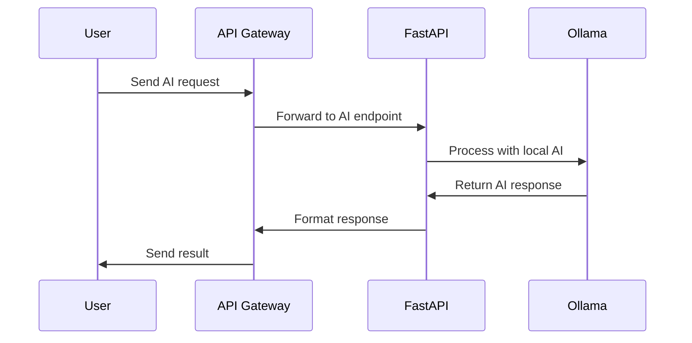

# SupaFast LLM Setup Guide (Beginner-Friendly)

## 1. Summary and Vision

Think of SupaFast LLM as your personal AI application platform that runs on your own computer or server. Instead of using cloud services like OpenAI or Firebase, you'll have your own:

- Secure login system (like having your own Google login)
- AI-ready database (for storing text, images, and AI data)
- API system (to connect your applications)
- Web interface (to manage everything)
- Local AI models (to run AI without cloud services)

Imagine having your own ChatGPT-like service, but one that:
- Runs on your computer
- Keeps your data private
- Can be customized for your needs
- Costs nothing to run (except your computer's resources)

## 2. Components Installed (What Each Piece Does)

### Your AI Brain (Core Components)
- **Supabase**: Your application's brain - handles data, users, and real-time updates
  - Think of it as your private Firebase/Google Cloud
  - Stores all your application data
  - Manages user logins
  - Sends real-time updates to users

### Your AI Memory (Database Components)
- **PostgreSQL**: The main database (like Excel on steroids)
- **pgvector**: Helps AI understand and search text/images
- **Supabase Studio**: A friendly interface to manage your data
- **pg_graphql**: Makes getting data easier

### Traffic Controllers (Proxy and Routing)
- **Nginx**: The main doorman - directs traffic to right places
- **Nginx Proxy Manager**: A friendly interface to manage traffic
- **Kong**: Security guard for your APIs

### AI Server (Application Components)
- **FastAPI**: The messenger between users and AI
  - Serves web pages
  - Handles API requests
  - Manages user tokens
  - Shows API documentation

### AI Assistant (New Component!)
- **Ollama**: Your personal AI assistant
  - Runs AI models locally
  - Works with models like Llama, Mistral, and others
  - Connects to your applications through FastAPI
  - Keeps all AI processing on your machine

### Helper Services
- **Supavisor**: Manages database connections
- **Vector**: Keeps track of what's happening
- **Storage API**: Handles file uploads/downloads
- **imgproxy**: Processes images
- **GoTrue**: Manages user logins
- **PostgREST**: Makes database access easy
- **Realtime**: Sends instant updates

## 3. What You Need (System Requirements)

### For Mac Users
- Any modern Mac (2019 or newer)
- M1/M2/M3 Mac or Intel Mac
- macOS Monterey (12.0) or newer
- At least 16GB RAM recommended
- 50GB free disk space
- Docker Desktop for Mac installed

### For Linux Users
- Modern Linux system
- 16GB RAM recommended
- 50GB free disk space
- Docker installed

## 4. Getting Started (Required Information)

### Domain Names (Your Website Addresses)
You'll need a domain name (like 'myaiapp.com'). We'll create these addresses:
```
Main website: apps.myaiapp.com
├── api.myaiapp.com     (for programs to talk to your AI)
├── studio.myaiapp.com  (for managing your data)
├── auth.myaiapp.com    (for user logins)
├── db.myaiapp.com      (for database access)
├── npm.myaiapp.com     (for managing web traffic)
└── ai.myaiapp.com      (for AI model access)
```

### Information You'll Need
1. Your domain name (like myaiapp.com)
2. Admin username (for your login)
3. Admin password (make it strong!)
4. Email address (for security certificates)
5. API key (will be generated for you)

### Ports (Communication Channels)
These numbers need to be available on your computer:
- 80: Regular web traffic
- 443: Secure web traffic
- 81: Management interface
- 5432: Database (internal only)
- 8000: API server (internal only)
- 11434: Ollama AI server (internal only)

## 5. Installation Guide (Step by Step)

### Before You Start
1. Install Docker Desktop for Mac
   - Download from [Docker Website](https://www.docker.com/products/docker-desktop)
   - Install like any other Mac application
   - Start Docker Desktop

2. Set up your domain name
   - Buy a domain (like from Namecheap or GoDaddy)
   - Point it to your computer's IP address
   - Wait 1-2 hours for it to work

3. Open required ports in your firewall
   - System Preferences → Security & Privacy → Firewall
   - Allow incoming connections for Docker and ports

4. Install Homebrew (Mac's package manager)
   ```bash
   /bin/bash -c "$(curl -fsSL https://raw.githubusercontent.com/Homebrew/install/HEAD/install.sh)"
   ```

### Installation Steps
```bash
# 1. Get the code
git clone https://github.com/loulibre/supafastllm.git
cd supafastllm

# 2. Make the setup script runnable
chmod +x setup_mac.sh

# 3. Run the setup
./setup_mac.sh
```

### Setting Up Your System
```bash
# Basic setup (recommended for beginners)
./setup_mac.sh

# Advanced setup with Nginx Proxy Manager
./setup_mac.sh --with-npm

# Setup with custom settings
./setup_mac.sh --proxy nginx|caddy
```

### After Installation
1. Open your website: https://apps.yourdomain.com
2. Log in to Supabase Studio: https://studio.yourdomain.com
3. Set up your SSL certificates (makes your site secure)
4. Configure your AI models in Ollama

## 6. Using the AI API

### How the AI System Works


### Setting Up AI Models
1. Access Ollama interface:
   ```bash
   # Pull a model (example: Mistral)
   curl http://localhost:11434/api/pull -d '{
     "name": "mistral"
   }'
   ```

2. Test your model:
   ```bash
   # Simple test
   curl http://localhost:11434/api/generate -d '{
     "model": "mistral",
     "prompt": "Hello, how are you?"
   }'
   ```

### Using the AI API
Example Python code to use your AI:
```python
import requests

# Make an AI request
response = requests.post(
    "https://api.yourdomain.com/v1/ai/generate",
    headers={
        "Authorization": "Bearer your_api_key"
    },
    json={
        "model": "mistral",
        "prompt": "Explain quantum computing"
    }
)

print(response.json())
```

## 7. Troubleshooting (Common Problems)

### If Nothing Works
1. Check if Docker is running
   - Open Docker Desktop
   - Look for the green "Running" status

2. Check your domain
   ```bash
   # Test your domain
   ping yourdomain.com
   ```

3. Restart everything
   ```bash
   # Stop all services
   docker compose down
   
   # Start fresh
   docker compose up -d
   ```

### If AI Isn't Working
1. Check Ollama is running:
   ```bash
   docker compose logs ollama
   ```

2. Verify model is installed:
   ```bash
   curl http://localhost:11434/api/list
   ```

3. Test AI directly:
   ```bash
   curl http://localhost:11434/api/generate -d '{
     "model": "mistral",
     "prompt": "test"
   }'
   ```

### Getting Help
- Check the logs:
  ```bash
  # See all logs
  docker compose logs
  
  # Check specific service
  docker compose logs fastapi
  ```

- Common fixes:
  ```bash
  # Restart a service
  docker compose restart fastapi
  
  # Rebuild everything
  docker compose down
  docker compose up -d --build
  ```

## 8. Resources (Learn More)

### Beginner Guides
- [Docker for Beginners](https://docker-curriculum.com/)
- [FastAPI Tutorial](https://fastapi.tiangolo.com/tutorial/)
- [Supabase Quick Start](https://supabase.com/docs/guides/getting-started)
- [Ollama Guide](https://github.com/ollama/ollama)

### Video Tutorials
- [Docker Desktop Basics](https://www.youtube.com/watch?v=wCTTHhehJbU)
- [FastAPI Crash Course](https://www.youtube.com/watch?v=tLKKmouUams)
- [Supabase Tutorial](https://www.youtube.com/watch?v=dU7GwCOgvNY)

### Community Help
- [Supabase Discord](https://discord.supabase.com)
- [FastAPI Discord](https://discord.fastapi.tiangolo.com)
- [Project Issues](https://github.com/loulibre/supafastllm/issues)

### AI Resources
- [Ollama Models](https://ollama.ai/library)
- [HuggingFace Models](https://huggingface.co/models)
- [Vector Database Guide](https://supabase.com/docs/guides/database/extensions/pgvector) 