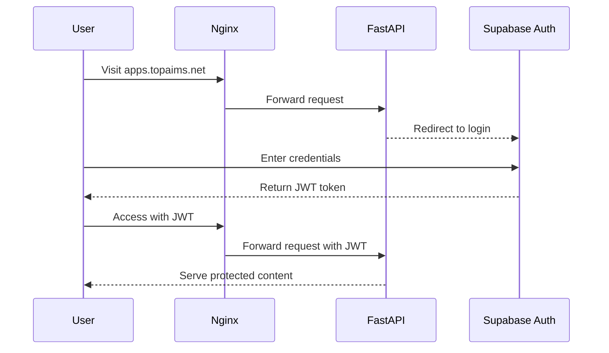

# User Authentication and Access Guide

## Overview
This document explains how users can access the web application at `apps.topaims.net` and the API at `api.topaims.net`. The system uses Supabase for authentication and FastAPI for serving web content and API endpoints.

## Authentication Flow

### 1. Initial Access
When a user visits `apps.topaims.net`, the following sequence occurs:



### 2. Login Process
1. User visits `apps.topaims.net`
2. If not authenticated:
   - Automatically redirected to Supabase Auth UI (`/auth/v1/login`)
   - User enters credentials
   - Upon successful login, receives JWT token
   - Token is stored in browser's local storage
3. If authenticated:
   - JWT token is included in requests
   - Access granted to protected content

### 3. Protected Content Access
- All web content under `/web/` requires authentication
- FastAPI verifies JWT token on each request
- Static content (including index.html) is served only to authenticated users

## API Access

### 1. API Endpoints
The API is accessible at `api.topaims.net` and requires different authentication:

- Public endpoints: No authentication required
  ```
  GET /api/v1/health
  ```

- Protected endpoints: Require API key
  ```
  GET /api/v1/protected
  Header: X-API-Key: your_api_key
  ```

### 2. API Authentication
- API endpoints use a separate authentication mechanism (API key)
- API key must be included in the `X-API-Key` header
- Different from web authentication (JWT)

## Port Configuration

### Web Access
- HTTP (Port 80) -> Automatically redirects to HTTPS
- HTTPS (Port 443) -> Main access point
- Internal ports are not exposed to users

### API Access
- Same port configuration as web access
- Routing handled by nginx based on domain name

## Security Notes

### JWT Token
- Issued by Supabase authentication
- Contains user information and permissions
- Validated on every request
- Expires based on configured timeout

### API Key
- Used only for API access
- Should be kept secure
- Can be rotated as needed
- Different from user authentication

## Error Handling

### Authentication Failures
1. Invalid or missing JWT:
   - Redirected to login page
   - Original URL preserved for post-login redirect

2. Invalid API key:
   - Returns 403 Forbidden
   - Error message in response

### Common Issues
1. Token Expiration:
   - User redirected to login
   - New token issued upon successful login

2. Invalid Credentials:
   - Error message displayed on login page
   - User can retry or reset password

## Development and Testing

### Local Testing
1. Access via `localhost`:
   - Same authentication flow applies
   - SSL certificates may differ

2. Testing API:
   ```bash
   # Health check
   curl https://api.topaims.net/api/v1/health

   # Protected endpoint
   curl -H "X-API-Key: your_api_key" https://api.topaims.net/api/v1/protected
   ```

### Environment Variables
Key variables that affect authentication:
- `JWT_SECRET`: For validating Supabase tokens
- `API_KEY`: For API authentication
- `NGINX_SERVER_NAME`: Domain configuration

## Additional Resources

### Related Documentation
- [Supabase Authentication](https://supabase.com/docs/guides/auth)
- [FastAPI Security](https://fastapi.tiangolo.com/tutorial/security/)
- [Nginx Configuration](https://nginx.org/en/docs/) 